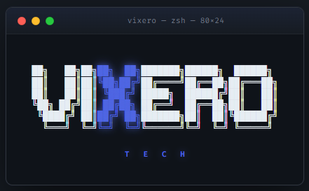

<div align="center">

**Vickson Ferrel** · Founder, Vixero Technology Enterprise

[](https://arxiv.org/abs/2604.02149)
[](https://www.nvidia.com/en-us/startups/)
[](https://huggingface.co/Vix0007)
[](https://github.com/Vix0007)
[](https://vixdev.cloud)

</div>

<div align="center">
  
</div>

# HBEE — Human Behavioral Entropy Engine

> *"Malware doesn't just compromise systems. It propagates through people."*

**Predictive insider threat intelligence via sociotechnical simulation.**

AEGIS catches the network anomaly after the attack begins. HBEE catches the human signal *before* it. The wager: insider threats, social engineering compromises, and coordinated breaches have *behavioral precursors* — trust decay, stress divergence, off-pattern communication, group polarization. If you can simulate an organization accurately enough, then inject real-world events at their historical timestamps, those precursors become *measurable*.

HBEE is the open-source research companion to a three-layer sociotechnical defense stack. This repository is the behavioral simulation layer only.

---

## The Stack

```
┌─────────────────────────────────────────────────────────────┐
│  HBEE   →  who is the threat      (behavioral prediction)   │  ← this repo
│  AEGIS  →  what they're doing     (network physics)         │     proprietary
│  V      →  autonomous response    (perimeter + isolation)   │     proprietary
└─────────────────────────────────────────────────────────────┘
```

HBEE is open. AEGIS and V are closed. The methodology is public; the validated corpora and trained models are not. *Research is open. Production is sovereign.*

---

## The Thesis

Traditional intrusion detection reads packets and flows. It is reactive by construction. By the time the network anomaly is legible, the breach has already begun.

Insider threats and advanced social engineering attacks don't start on the wire. They start in a person — a stressed engineer, a disgruntled admin, a finance lead whose email patterns shift three weeks before they exfiltrate. That signal has been documented retrospectively in every major incident from Enron to SolarWinds. **Nobody has built the system to detect it prospectively.**

HBEE is a bet that you can. Not by surveilling employees — by simulating them honestly enough that the trajectory of a real organization becomes measurable against the trajectory of a synthetic one.

---

## Architecture

```
┌─────────────────────────────────────────────────┐
│                   HBEE Stack                    │
├─────────────────────────────────────────────────┤
│  AgentSociety 1.1.3 (Tsinghua FIB Lab)          │
│  150 agents | 20-min/tick clock                 │
├─────────────────────────────────────────────────┤
│  GLM-4.7 Flash int4 via vLLM                    │
│  Preserved Thinking + Interleaved Thinking      │
│  Emotional state continuity across ticks        │
├─────────────────────────────────────────────────┤
│  NVIDIA RAPIDS cuGraph                          │
│  Social graph analytics | Blast radius queries  │
├─────────────────────────────────────────────────┤
│  RTX 3090 24GB | Ubuntu 22.04 | CUDA 13.2       │
└─────────────────────────────────────────────────┘
```

**Why GLM-4.7?** Preserved Thinking and Interleaved Thinking modes maintain emotional and cognitive state continuity across multi-turn simulation ticks natively — no external state management hacks. If Dave is frustrated at tick 3, he is still frustrated at tick 7 without being told to be. That is the core requirement for authentic behavioral simulation, and the primary reason GLM-4.7 was chosen over alternatives.

---

## What HBEE Does (Today)

Phase 1 — April 2026.

- Simulates a 150-agent corporate environment across R&D, Engineering, and Operations
- Each agent carries: persistent emotional state, compounding stress, trust scores toward every other agent, position in a weighted social graph
- Agents act on 20-minute ticks: slack each other, browse a mock intranet, form opinions, react to internal and external events
- Event injection infrastructure: arbitrary events can be scheduled at specific ticks — org announcements, CVE disclosures, news items, internal incidents
- Per-tick logging of behavioral entropy, trust deltas, communication graphs

What Phase 1 is **not**: a detector, a classifier, or a validated prediction system. It is the substrate. The research question — *can behavioral collapse be predicted from public-data-only inputs* — is Phase 3.

---

## Validation Methodology (Research North Star)

The only defensible test for a predictive behavioral system is **retroactive** — run the simulation against a historical incident using only the information that was publicly available at the time, and measure whether the system's risk trajectory for the eventual actor diverged from baseline *before* the documented attack.

**Planned evaluation incidents:**

| incident | year | archetype |
|----------|------|-----------|
| Enron | 2001 | financial fraud + cultural collapse |
| SolarWinds | 2020 | supply-chain + insider precursors |
| Uber | 2022 | social engineering + credential theft |

**Methodological constraints (non-negotiable):**

- **Timestamp-gating**: every injected event must be provably sourced from a document dated before the event's injection tick. Any data leakage from retrospective analyses voids the run.
- **Public-data-only**: no internal company documents, no post-hoc reporting, no interviews. Only the news, filings, and disclosures that were public at that date.
- **Pre-registered signal**: the "behavioral collapse" signal — what counts as a hit — must be defined and published *before* the validation is run, not fitted after.
- **Null runs**: same methodology against matched organizations that did *not* experience the incident, to establish false-positive baseline.

The target claim takes the form: *"HBEE flagged N agents in the trajectory cone of behavioral collapse K days before network-observable anomaly, using only timestamp-gated public data, at false positive rate F."*

We have not made that claim. This document describes the system being built to find out whether the claim is defensible.

---

## Why This Matters

**The Human Entropy Horizon.** AEGIS V3 identifies a fundamental detection limit: flow-based thermodynamic detection cannot distinguish between a direct human connection and a perfectly mimicked human proxy. Adversaries operating at human speeds approach invisibility on the network.

HBEE attacks the same horizon from the other side. If the network signal is ambiguous, the organizational signal that *precedes* it may not be. A compromised endpoint doesn't need to be distinguished from a human at the packet level if the human at the keyboard was already behaviorally off-pattern three days earlier.

This is not surveillance. Real organizations deploy HBEE against simulated versions of themselves and measure the delta. The production signal is *divergence from the simulation*, not the employees directly.

---

## Research Context

HBEE sits at the intersection of:

- **Multi-agent social simulation** — prior work: Smallville (Park et al., 2023, 25 agents), AgentSociety (Tsinghua FIB Lab)
- **Sociotechnical systems security** — largely uncrowded academic niche
- **Organizational psychology of insider threat** — Shaw & Fischer (CERT), Greitzer, Band
- **Adversarial corpus generation** — for ML-based intrusion detection

Nearest prior work is Stanford's Smallville. HBEE extends that paradigm in three directions: **scale** (6× agent count), **instrumentation** (security-grade behavioral logging), and **adversarial eventing** (ground-truth breach propagation traces). The insider-threat-psychology layer and the retroactive validation methodology have no direct prior.

**Target venues:** USENIX Security, IEEE S&P, NDSS.

---

## Roadmap

| phase | scope | status |
|-------|-------|--------|
| 1 | Simulation substrate, agent persistence, event injection | ✅ active |
| 2 | Retroactive event pipeline, timestamp-gated data feed | 🔧 in design |
| 3 | Historical incident validation (Enron, SolarWinds, Uber) | 🎯 research north star |
| 4 | Behavioral signature extraction → network labels → PELT bridge | 🔭 future |
| 5 | Sovereign ASEAN pilot deployments | 🔭 future |

Phase 4 is the eventual bridge to the AEGIS successor (PELT). HBEE does not generate PCAP. It generates *labels* — which agents, at which times, were on pre-attack trajectories — that a future detector can train against. That bridge is not built and is not a Phase 1–3 commitment.

---

## What's Open and What Isn't

| layer | status | why |
|-------|--------|-----|
| HBEE framework | **open source** | research methodology must be reproducible |
| Simulation code + agent architecture | **open source** | see above |
| Validated behavioral corpora (post Phase 3) | **gated / commercial** | the corpus is the moat |
| Trained signature models | **proprietary** | weights reflect corpus investment |
| AEGIS detector (V3) | **proprietary** | production defensive system |
| V autonomous response layer | **proprietary** | production defensive system |
| AEGIS paper | **public** | [arXiv:2604.02149](https://arxiv.org/abs/2604.02149) |

Open sourcing HBEE accelerates the research. Keeping the corpus and trained weights gated preserves the asset. Standard separation.

---

## Status

> **Phase 1 — Active** (April 2026)
> Simulation environment stable. 150 agents running. Trust scoring, stress propagation, social graph analytics, and event injection infrastructure present and operating. Retroactive validation pipeline (Phase 2) in design.

---

## Citing

If you use or reference HBEE in research:

```bibtex
@software{ferrel_hbee_2026,
  author  = {Ferrel, Vickson},
  title   = {HBEE: Human Behavioral Entropy Engine},
  year    = {2026},
  url     = {https://github.com/Vix0007/HBEE},
  note    = {Sociotechnical simulation framework for predictive insider threat intelligence}
}
```

AEGIS (the network-physics companion): [arXiv:2604.02149](https://arxiv.org/abs/2604.02149)

---

## Author

**Vickson Ferrel** | Founder, Vixero Technology Enterprise
Universiti Malaysia Sarawak (UNIMAS) · arXiv Researcher · NVIDIA Inception Member

- arXiv: [2604.02149](https://arxiv.org/abs/2604.02149)
- HuggingFace: [Vix0007](https://huggingface.co/Vix0007)
- Web: [vixdev.cloud](https://vixdev.cloud)

---

<div align="center">

*Vixero Technology Enterprise · Kuching, Sarawak, Malaysia*

*For Humanity, From Humanity.* 🇲🇾

</div>
